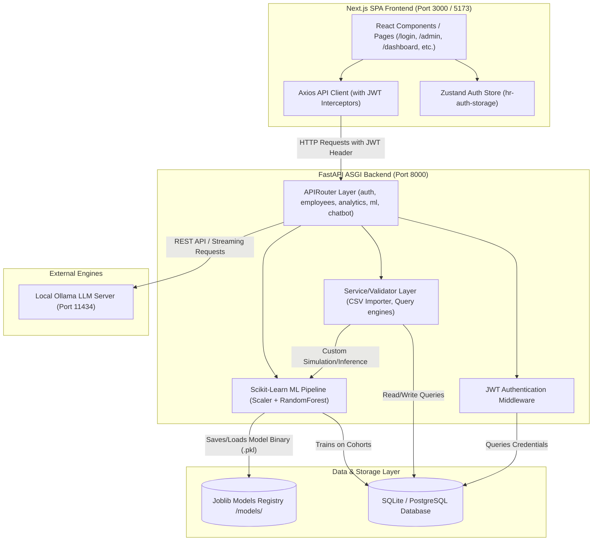
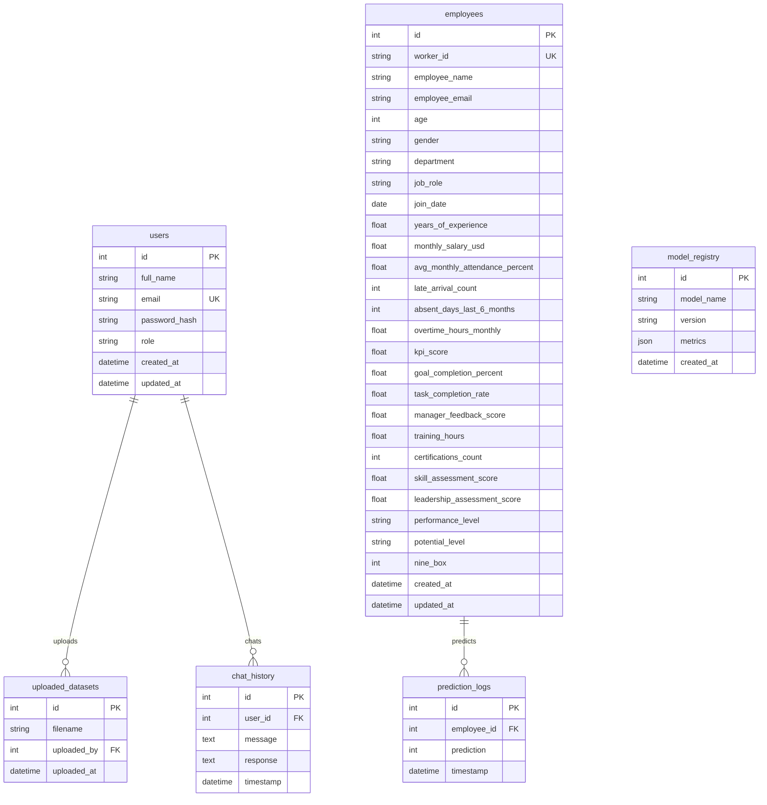
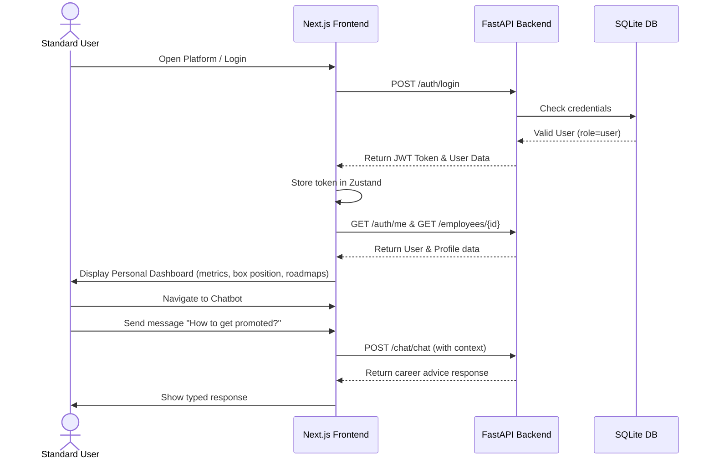
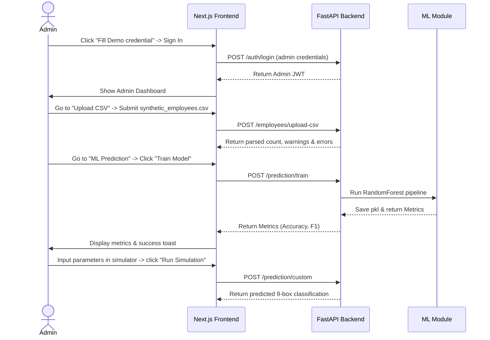
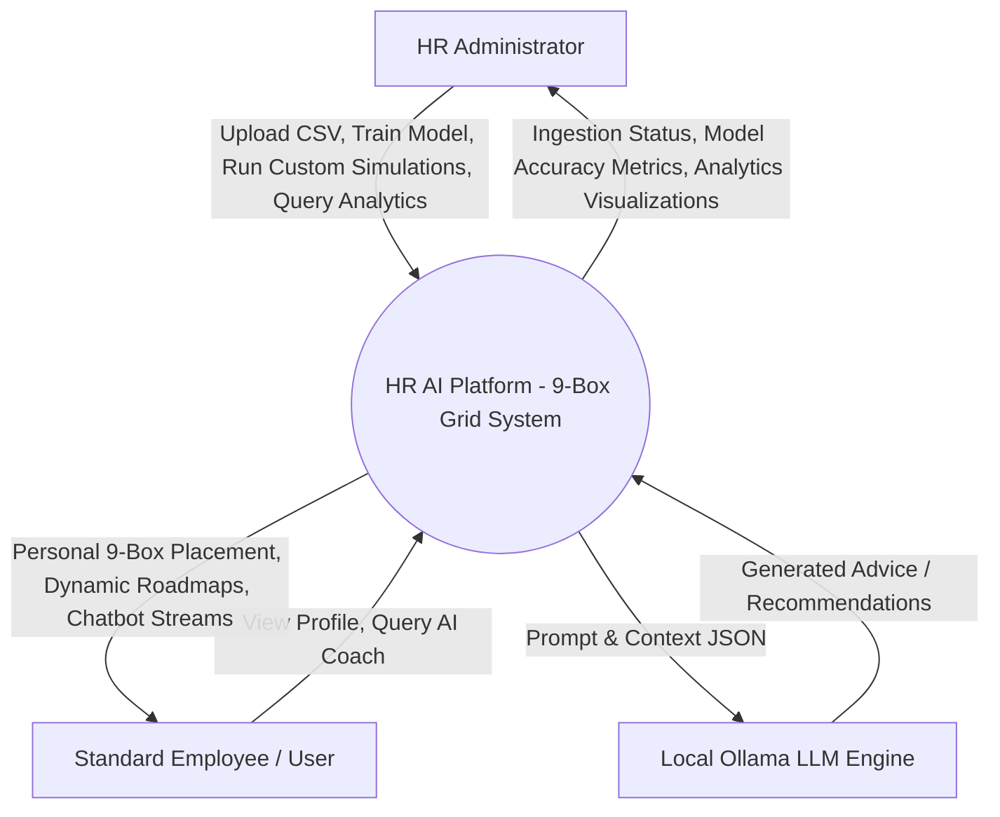
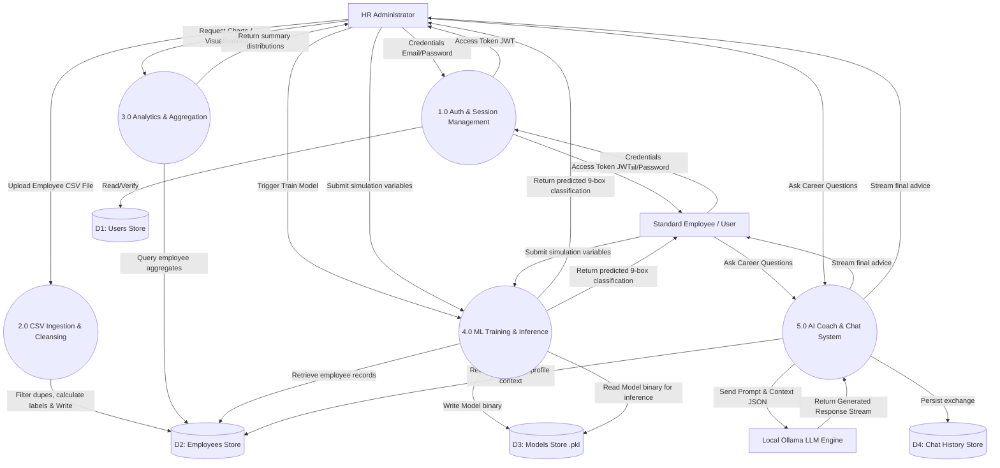

# REPORT_CONTEXT.md — HR AI Platform (9-Box Grid Management System)

This document is a comprehensive technical knowledge base for the completed **HR AI Platform - 9-Box Grid** project. It outlines the codebase structure, dependencies, database schemas, authentication flows, backend and frontend architectures, machine learning modules, and deployment configurations. It serves as a unified reference source of truth for downstream AI consumption.

---

## 1. Executive Overview

- **Project Name**: HR AI Platform - 9-Box Grid Management System
- **Project Category**: Enterprise Human Resource Analytics & AI-Driven Talent Management
- **Problem Statement**: Traditional talent management relies on subjective, sporadic reviews. Managers often struggle to objectively evaluate employees and place them on the 9-Box Grid (a classic HR assessment framework measuring Performance vs. Potential). Manual mapping of thousands of employees is highly inefficient, prone to cognitive bias, and lacks immediate, actionable developmental coaching for the assessed workforce.
- **Purpose**: The HR AI Platform automates the 9-Box Grid placement using explicit quantitative formulas and a trained Random Forest machine learning classifier. It provides a real-time HR analytics dashboard, automated rule-based and LLM-enhanced professional recommendations, and an interactive AI coaching conversational assistant (Chatbot) for managers and staff.
- **Target Users**:
  - **HR Administrators**: Upload employee datasets (CSV), train predictive ML models, view full workforce statistics, run simulations on employee profiles, and access advanced recommendations.
  - **Standard Employees (Users)**: Access their personal 9-Box classification, view individual developmental roadmaps, and interact with the AI Career Coach.
- **Objectives**:
  - Automate 9-Box Grid classification based on multidimensional performance and potential metrics.
  - Deliver predictive modeling capabilities to evaluate hypothetical employee scenarios.
  - Provide a dashboard showing key HR statistics (KPI averages, salary ranges, gender splits, and grid distribution).
  - Enable conversational career guidance through local LLMs with intelligent rule-based fallbacks.
- **Major Features**:
  - Role-based Access Control (Admin / User portals).
  - Smart CSV Importer with cleaning, type coercion, deduplication, and auto-mapping.
  - Interactive 9-Box Grid Heatmap with dynamic tooltips and cohort counts.
  - Machine Learning Model Training (Scikit-Learn RandomForestClassifier) and predictions.
  - AI Recommendation Engine combining deterministic rules with LLM personalization.
  - Conversational AI Chatbot (Ollama Integration) with message streaming and database history persistence.
- **Core Technologies**:
  - **Programming Languages**: Python 3.11 (Backend), TypeScript / JavaScript (Frontend).
  - **Backend Framework**: FastAPI (Asynchronous ASGI).
  - **Database**: SQLite (local development / configured via `DATABASE_URL` in `.env`), PostgreSQL (supported for production).
  - **ORM**: SQLAlchemy 2.0 with Alembic for migrations.
  - **Machine Learning**: Scikit-Learn 1.4+, Pandas, NumPy, Joblib.
  - **AI / LLM Integration**: Ollama (orchestrated via `requests`, supporting models like `qwen2.5:7b`, `phi3:mini`, or `llama3:8b`).
  - **Frontend Framework**: Next.js 14.2+ (App Router), React 18, Zustand (State Management), React Hook Form, Tailwind CSS, Lucide React (Icons), and Recharts (Data Visualization).
  - **Authentication**: JSON Web Tokens (JWT) using `python-jose` and `passlib` with `bcrypt` password hashing.
  - **Overall Architecture**: Decoupled Client-Server (Single Page Application frontend communicating via RESTful API with a stateless backend).
  - **Deployment Model**: Docker Compose ready (Dockerfiles for both frontend and backend) or local execution.

---

## 2. Complete System Architecture



- **Stateless FastAPI Backend**: Processes incoming requests, manages auth middleware, coordinates database transactions, trains the Random Forest classifier, and forwards LLM queries to the Ollama server.
- **JWT Authentication Flow**:
  1. The client sends a `POST /auth/login` request.
  2. The server verifies credentials against database-stored `bcrypt` hashes.
  3. If correct, a JWT access token is signed using `HS256` with the user ID, role, and email as payload and sent back.
  4. The frontend stores this token in `localStorage` inside the Zustand `hr-auth-storage` state.
  5. Subsequent requests pass the token in the `Authorization: Bearer <TOKEN>` header.
- **API Router Layer**: Subdivided into domain-specific routers: `auth`, `employees`, `analytics`, `ml`, `recommendation`, and `chatbot`.
- **Database Connection Layer**: `SQLAlchemy` engine initiates connections. A FastAPI dependency `get_db` opens a session per request and guarantees its closure upon response finalization.
- **Data Pipelines**:
  - **CSV Upload Workflow**: The admin uploads a CSV. FastAPI reads it into memory. `Pandas` processes and validates it through `clean_dataframe` in `app/employees/validators.py`. Records missing `worker_id` are skipped. Numeric fields are cleaned, defaults are populated, and the 9-box labels are determined using explicit formulas before committing to the DB.
  - **Model Training Workflow**: Reads employees from the DB. Pulls feature variables and target labels into a Pandas DataFrame. Fits a StandardScaler and OneHotEncoder preprocessing pipeline, trains a `RandomForestClassifier` with 100 estimators, calculates metrics, saves the model pipeline to `models/employee_9box_model.pkl`, and writes performance metrics to the database registry.
  - **LLM/Ollama Pipeline**: Features are serialized to JSON context. The backend formats an engineering system prompt, sends it to `http://localhost:11434/api/generate`, and streams the tokens back to the frontend.

---

## 3. Folder Structure

The repository is structured logically to separate backend concerns from the frontend application:

- [hr-ai-platform/](file:///c:/PHASE%202/hr-ai-platform) (Root Directory)
  - [app/](file:///c:/PHASE%202/hr-ai-platform/app): Python FastAPI Backend application code.
    - [main.py](file:///c:/PHASE%202/hr-ai-platform/app/main.py): Application entry point, CORS middleware setup, table creation hooks, and router registrations.
    - [config.py](file:///c:/PHASE%202/hr-ai-platform/app/config.py): BaseSettings class loading configuration variables from environment or `.env` files.
    - [dependencies.py](file:///c:/PHASE%202/hr-ai-platform/app/dependencies.py): Security dependencies (`get_current_user` and `require_admin`) utilizing FastAPI's dependency injection.
    - [auth/](file:///c:/PHASE%202/hr-ai-platform/app/auth): Sign-up, login logic, JWT creation, and encryption utils.
    - [users/](file:///c:/PHASE%202/hr-ai-platform/app/users): SQLAlchemy model definitions for `User`, `ChatHistory`, `ModelRegistry`, `PredictionLog`, and `UploadedDataset`.
    - [employees/](file:///c:/PHASE%202/hr-ai-platform/app/employees): Database models, validators, service functions, and routing for employee entities and CSV uploads.
    - [analytics/](file:///c:/PHASE%202/hr-ai-platform/app/analytics): Analytical queries including dynamic salary histograms, department performance leaderboards, and grid splits.
    - [ml/](file:///c:/PHASE%202/hr-ai-platform/app/ml): Pipeline components for model training (`trainer.py`) and inference/predictions (`predictor.py`).
    - [recommendation/](file:///c:/PHASE%202/hr-ai-platform/app/recommendation): Logic driving Box-specific strategies and prompt formatting.
    - [chatbot/](file:///c:/PHASE%202/hr-ai-platform/app/chatbot): Ollama REST client, model status checking, streaming responses, and conversation histories.
    - [database/](file:///c:/PHASE%202/hr-ai-platform/app/database): Session generators (`get_db`) and metadata bases.
    - [synthetic_data/](file:///c:/PHASE%202/hr-ai-platform/app/synthetic_data): Generator script (`generator.py`) creating a 5,000-record CSV containing synthetic metrics.
  - [frontend/](file:///c:/PHASE%202/hr-ai-platform/frontend): React Next.js SPA application.
    - [src/app/](file:///c:/PHASE%202/hr-ai-platform/frontend/src/app): Next.js App Router containing route pages (`/login`, `/signup`, `/admin`, `/dashboard`, and sub-pages).
    - [src/components/](file:///c:/PHASE%202/hr-ai-platform/frontend/src/components): Shared UI components including layouts (`DashboardLayout.tsx`, `Sidebar.tsx`, `TopBar.tsx`).
    - [src/lib/](file:///c:/PHASE%202/hr-ai-platform/frontend/src/lib): API client layer utilizing Axios interceptors to auto-attach tokens and handle 401 logouts.
    - [src/store/](file:///c:/PHASE%202/hr-ai-platform/frontend/src/store): Zustand persist-middleware store managing user sessions.
  - [models/](file:///c:/PHASE%202/hr-ai-platform/models): Serialized machine learning pipelines (`.pkl`).
  - [data/](file:///c:/PHASE%202/hr-ai-platform/data): Directory holding generated CSV files.
  - [tests/](file:///c:/PHASE%202/hr-ai-platform/tests): Pytest suite covering auth, analytics, employees, predictions, and chatbot APIs.
  - [alembic/](file:///c:/PHASE%202/hr-ai-platform/alembic): Database migration configurations and historical scripts.

---

## 4. Technology Stack

- **FastAPI (v0.110+)**: Chosen for its high performance, native support for async processes, Pydantic data validation, and automated OpenAPI documentation generation.
- **SQLAlchemy (v2.0+)**: Translates database queries to Python objects, shielding the backend from SQL injection, and facilitating transition from SQLite to PostgreSQL.
- **Alembic**: Manages database migrations.
- **Scikit-Learn (v1.4+)**: Simplifies machine learning model implementation. The `RandomForestClassifier` handles non-linear variables and limits overfitting.
- **Pandas (v2.2+) & NumPy**: Efficiently ingest, structure, clean, and manipulate large scale tabular CSV metrics.
- **Ollama**: Integrates LLMs directly within private local environments, keeping data secure without incurring third-party API costs.
- **React (v18) & Next.js (v14)**: Next.js is configured to build as a Single Page Application. It offers robust routing, layout controls, and component lifecycle structures.
- **Tailwind CSS**: A utility-first CSS framework ensuring highly customizable, responsive, and unified layouts.
- **Recharts**: D3-backed, React-friendly chart library for responsive salary bars, gender rings, and department performance rankings.
- **Zustand**: Lightweight state manager replacing Redux, storing JWT tokens and profiles locally.

---

## 5. Database Documentation

The system is configured to support SQLite (`sqlite:///./hr_ai_platform.db`) for lightweight local usage and PostgreSQL for production environments.

### Data Models & Schemas



#### Detailed Fields: `employees` Table
- `id` (Integer, Primary Key)
- `worker_id` (String(50), Unique Index, Not Null)
- `employee_name` (String(255))
- `employee_email` (String(255))
- `age` (Integer)
- `gender` (String(10))
- `department` (String(100))
- `job_role` (String(100))
- `join_date` (Date)
- `years_of_experience` (Float)
- `monthly_salary_usd` (Float)
- `avg_monthly_attendance_percent` (Float)
- `late_arrival_count` (Integer)
- `absent_days_last_6_months` (Integer)
- `overtime_hours_monthly` (Float)
- `kpi_score` (Float)
- `goal_completion_percent` (Float)
- `task_completion_rate` (Float)
- `manager_feedback_score` (Float)
- `training_hours` (Float)
- `certifications_count` (Integer)
- `skill_assessment_score` (Float)
- `leadership_assessment_score` (Float)
- `performance_level` (Enum: Low/Medium/High)
- `potential_level` (Enum: Low/Medium/High)
- `nine_box` (Integer: 1 to 9)

---

## 6. Authentication & Security

- **Sign-Up**: Users specify name, email, role (`admin` or `user`), and password. The password is encrypted with `bcrypt` (12 rounds) using `passlib.context.CryptContext`.
- **Sign-In**: Validates email and verifies the password hash. Generates a signed JWT access token.
- **JWT (JSON Web Tokens)**: Signed on the server using `jose.jwt` with `HS256` encryption. Token payload stores user ID (`sub`), role, and email. The token expires in 60 minutes.
- **Route Authorization**:
  - `get_current_user`: Decode token and fetch the associated User object.
  - `require_admin`: Dependency wrapping `get_current_user`. Raises `HTTPException(403)` if user's role is not `admin`.
- **Frontend Role Protection**: `DashboardLayout` checks the state of `useAuthStore`. If a standard user attempts to visit `/admin` routes, they are automatically redirected to `/dashboard`.
- **Database Security**: SQLAlchemy maps inputs to bind parameters, preventing SQL injection attacks.

---

## 7. Backend Documentation

The backend uses FastAPI and is split into modular routers located under `app/`.

### Auth Router (`app/auth/routes.py`)
- `POST /auth/signup`: Registers a new user. Throws `400` if the email is already in use.
- `POST /auth/login`: Validates password and issues a token.
- `GET /auth/me`: Verifies the token and returns the current user profile.

### Employees Router (`app/employees/routes.py`)
- `POST /employees/upload-csv`: Parses an uploaded CSV file. Uses Pydantic and Pandas validators, filters duplicates, saves valid records, and log details. Requires admin access.
- `GET /employees`: Paginated list of employee records (requires admin).
- `GET /employees/search`: Full-text search of employee names and worker IDs.
- `GET /employees/{employee_id}`: Retrieves details of a specific employee.

### Analytics Router (`app/analytics/routes.py`)
- `GET /analytics/summary`: General stats (totals, gender splits, average KPI, and attendance).
- `GET /analytics/salary-distribution`: Generates salary bins dynamically based on actual data range.
- `GET /analytics/department-performance`: Aggregates and ranks KPI scores by department.
- `GET /analytics/9box-distribution`: Grouped count of employees in each box (1-9).
- `GET /analytics/gender-distribution`: Aggregated employee gender counts.
- `GET /analytics/performance-distribution`: In-place distribution of performance levels.

### ML Router (`app/ml/routes.py`)
- `POST /prediction/train`: Fits the Random Forest pipeline on the database records, registers performance metrics, and saves the binary model.
- `GET /prediction/employee/{employee_id}`: Evaluates a stored employee profile against the classifier model and records prediction event.
- `POST /prediction/custom`: Dynamically predicts the 9-box position for simulated data.
- `GET /prediction/metrics`: Fetches training parameters and accuracy scores.

### Recommendation Router (`app/recommendation/routes.py`)
- `GET /recommendation/{employee_id}`: Collects employee features and queries local LLM to generate recommendations. Falls back to static rules if the LLM is offline.

### Chatbot Router (`app/chatbot/routes.py`)
- `POST /chat/chat`: Standard chat endpoint. Feeds the system prompt and optional employee context to Ollama.
- `POST /chat/stream`: Streams chatbot responses token-by-token.
- `GET /chat/history`: Fetches up to 50 previous exchanges for the current user.

---

## 8. Frontend Documentation

Built with Next.js 14, React 18, Zustand, and Tailwind CSS.

### Pages Structure
- `/login`: Clean interface with input fields and a **"Fill Demo credential"** button to automatically populate credentials.
- `/signup`: User registration screen supporting role selection.
- `/admin`: Interactive admin hub containing KPI summaries, charts, and the 9-box grid. Clicking grid boxes displays details for the corresponding cohort.
- `/admin/upload`: Drag-and-drop CSV uploader displaying status messages and warnings.
- `/admin/employees`: Paginated table of employees with links to detailed profile cards.
- `/admin/search`: Live search tool linking to employee detail views.
- `/admin/prediction`: Form to simulate employee parameters, calculate 9-box classifications, and view personalized AI recommendations. Includes a sidebar to train the ML model.
- `/admin/metrics`: Displays model training metrics (Accuracy, Precision, Recall, F1) and the confusion matrix.
- `/admin/chatbot` & `/chatbot`: Real-time chat interface with the AI Career Coach.
- `/dashboard`: Personal dashboard for standard employees, showing their metrics, grid placement, and recommendation roadmaps.

### State & Components
- **useAuthStore**: Zustand store managing session tokens and user state, persisted in `localStorage`.
- **Axios Interceptors**: Automatically append bearer tokens to requests and redirect users to `/login` if token verification fails (401).

---

## 9. AI Module Documentation

### Machine Learning Classifier
- **Pipeline**: Processes inputs through standard scaling and one-hot encoding before passing them to a `RandomForestClassifier`.
- **Target Label**: `nine_box` position (1-9).
- **Features**: Considers demographic, financial, attendance, performance, and potential metrics (18 variables).
- **Evaluation**: Computes accuracy, precision, recall, and F1 scores, as well as a confusion matrix.

### Conversational Career Coach (LLM Chatbot)
- **Engine**: Local Ollama server (`phi3:mini` or similar).
- **System Prompt**: Defines the model's role as an empathetic, data-driven HR Assistant.
- **Context Injection**: Passes employee statistics to the LLM alongside the user's message.
- **Rule-Based Fallbacks**: Returns predefined developmental advice if Ollama is offline.

---

## 10. Functional Modules

### CSV Processing Module
- **Purpose**: Parses, validates, cleans, and imports bulk employee data.
- **Business Logic**: Automatically calculates `performance_level`, `potential_level`, and `nine_box` positions from raw metrics using mathematical formulas.
- **Formulas**:
  - **Performance Score**:
    $$\text{Perf} = 0.30 \times \text{KPI} + 0.25 \times \text{Goal} + 0.20 \times \text{Task} + 0.15 \times \text{Feedback} + 0.10 \times \text{Attendance} - (0.8 \times \text{Late}) - (1.5 \times \text{Absent})$$
  - **Potential Score**:
    $$\text{Pot} = 0.25 \times \text{Skill} + 0.25 \times \text{Leadership} + 0.20 \times \text{Training} + 0.15 \times \text{Certs} + 0.15 \times \text{Experience}$$
  - **Classifications**:
    - Low Performance: $<50$, Medium Performance: $50 \text{ to } <75$, High Performance: $\ge 75$
    - Low Potential: $<45$, Medium Potential: $45 \text{ to } \le 70$, High Potential: $>70$

---

## 11. User Workflows



---

## 12. Admin Workflows



---

## 13. Complete API Documentation

### POST `/auth/signup`
- **Headers**: `Content-Type: application/json`
- **Body**: `{ "full_name": "...", "email": "...", "password": "...", "role": "admin" | "user" }`
- **Response**: `{ "id": 1, "full_name": "...", "email": "...", "role": "admin" }`

### POST `/auth/login`
- **Headers**: `Content-Type: application/json`
- **Body**: `{ "email": "...", "password": "..." }`
- **Response**: `{ "access_token": "...", "token_type": "bearer", "role": "admin", "full_name": "...", "user_id": 1 }`

### POST `/employees/upload-csv`
- **Headers**: `Content-Type: multipart/form-data`, `Authorization: Bearer <token>`
- **Body**: File payload under key `file`.
- **Response**: `{ "inserted": 5000, "skipped": 0, "total_in_file": 5000, "errors": [] }`

### GET `/analytics/salary-distribution`
- **Headers**: `Authorization: Bearer <token>`
- **Response**: `[ { "range": "$1k-$2k", "count": 1500, "min": 1000.0, "max": 2000.0 }, ... ]`

### POST `/prediction/train`
- **Headers**: `Authorization: Bearer <token>`
- **Response**: `{ "status": "Model trained successfully", "metrics": { "accuracy": 1.0, "precision": 1.0, "recall": 1.0, "f1": 1.0, "confusion_matrix": [...], "training_samples": 4000, "test_samples": 1000 } }`

---

## 14. Error Handling
- **CSV Ingestion Validation**: Handles missing fields, incorrect data types, and duplicate entries. Issues non-blocking warnings while continuing to parse valid rows.
- **Graceful Fallbacks**: If the Ollama server is offline or fails to respond, the system falls back to rule-based recommendations and predefined chat responses.
- **API Exceptions**: Returns standardized JSON error payloads (`{ "detail": "..." }`) and logs the traceback on the server.

---

## 15. Performance
- **Database**: Uses indexes on query keys like `worker_id` and `email` to speed up queries.
- **Bulk inserts**: Implements `db.bulk_save_objects` during CSV imports to reduce network overhead.
- **Async I/O**: Leverages FastAPI's async execution model for parallel task handling.
- **Response Streaming**: Streams chat tokens as they are generated to improve user experience.

---

## 16. Testing
- **API Tests**: Located in `tests/test_api.py` using `pytest` and `fastapi.testclient.TestClient`.
- **Coverage**: Uses a temporary SQLite database (`test.db`) to verify endpoints for authentication, analytics, employee directory search, model metrics, and chat histories.

---

## 17. Deployment
- **Docker Compose**: Orchestrates multi-container setups.
  - **Backend container**: Runs Uvicorn on port 8000 using Python base images.
  - **Frontend container**: Builds Next.js resources and exposes port 3000.
- **Environment variables**: Configured via `.env` file (`DATABASE_URL`, `SECRET_KEY`, `OLLAMA_BASE_URL`, and `FRONTEND_URL`).

---

## 18. Engineering Analysis
- **Design Decisions**:
  - Decoupled Frontend and Backend: Enables independent scaling of the user interface and the computational API.
  - Single-Model Pipeline: Saves the data preprocessor (scaler/encoder) and classifier inside a single Joblib pipeline to prevent training-serving skew.
- **Trade-offs**: Local model execution requires significant server memory and compute power. Implementing text streaming and rule-based fallbacks helps mitigate latency.

---

## 19. Standards
- **Coding Conventions**: Follows PEP 8 for Python backend code and ESLint rules for TypeScript.
- **Restful APIs**: Uses standard HTTP verbs and JSON formats.
- **Data Safety**: Uses ORM parameterized queries to prevent SQL injections and stores passwords using `bcrypt` hashes.

---

## 20. Project Timeline Reconstruction
- **Phase 1: Foundation (Inferred)**: Project setup, database schema design, and basic user authentication.
- **Phase 2: Ingestion & Core Logic (Inferred)**: CSV upload module, validation rules, and mathematical 9-box calculations.
- **Phase 3: Machine Learning (Inferred)**: Training pipeline setup, model registry implementation, and custom simulation routing.
- **Phase 4: AI & Chatbot (Inferred)**: Ollama API client integration, prompt engineering, history tracking, and response streaming.
- **Phase 5: User Interface (Inferred)**: Building dashboard layouts, integrating Recharts, and implementing interactive views.

---

## 21. Libraries

### Backend (`requirements.txt`)
- `fastapi`, `uvicorn`: Web routing and server.
- `sqlalchemy`, `alembic`: Database ORM and migrations.
- `pydantic`, `pydantic-settings`: Data validation and configuration management.
- `pandas`, `numpy`: Tabular data processing.
- `scikit-learn`, `joblib`: Machine learning model management.
- `passlib[bcrypt]`, `python-jose[cryptography]`: Encryption and token operations.
- `requests`: Direct integration with the Ollama API.
- `faker`: Synthetic data generation.

### Frontend (`package.json`)
- `next`, `react`, `react-dom`: Core application framework.
- `zustand`: Session and global state management.
- `recharts`: Dashboard data visualization.
- `react-hook-form`: Form management and validation.
- `tailwind-merge`, `clsx`: Utility classes for styling.
- `lucide-react`: Icon set.

---

## 22. Environment Setup

1. **Clone project and setup virtual environment**:
   ```bash
   cd hr-ai-platform
   python -m venv venv
   venv\Scripts\activate
   pip install -r requirements.txt
   ```
2. **Configure environment variables**:
   Create a `.env` file based on `.env.example`:
   ```env
   DATABASE_URL=sqlite:///./hr_ai_platform.db
   SECRET_KEY=your-super-secret-jwt-key
   OLLAMA_BASE_URL=http://localhost:11434
   OLLAMA_MODEL=qwen2.5:7b
   ```
3. **Database Setup & Seeding**:
   ```bash
   python -m app.synthetic_data.generator
   python seed.py
   ```
4. **Run Backend Server**:
   ```bash
   uvicorn app.main:app --port 8000
   ```
5. **Run Frontend Server**:
   ```bash
   cd frontend
   npm install
   npm run dev
   ```

---

## 23. Challenges
- **Local LLM Latency**: Solved by streaming responses token-by-token and implementing rule-based fallbacks.
- **Model Training Skew**: Avoided by saving the preprocessor and estimator together inside a single Joblib pipeline.

---

## 24. Limitations
- **Ollama Dependency**: The chatbot requires an active Ollama instance. When offline, it falls back to static responses.
- **Training Data Size**: Requires at least 50 employee records to train the Random Forest model.

---

## 25. Future Improvements
- **Real-Time Data Sync**: Integrate WebSockets for live analytics updates.
- **External LLM Provider Support**: Support external APIs like OpenAI as alternatives to local Ollama instances.

---

## 26. Mapping to Final Year Report

### Chapter 1: Introduction
- **Motivation**: Automating talent evaluation processes to reduce bias and increase efficiency.
- **Objectives**: Quantify performance, train predictive classifiers, and provide conversational career guidance.
- **Methodology**: Decoupled Next.js and FastAPI architecture, Random Forest classification, and local LLM integration.

### Chapter 2: Literature Review
- **Literature Review**: Compares traditional 9-Box grids with automated systems and reviews Random Forest and LLM technologies.
- **Gap Analysis**: Existing tools are often expensive and lack built-in local AI coaching capabilities.

### Chapter 3: Methodology / System Design
- **Functional Requirements**: CSV imports, analytics, predictive simulations, and conversational coaching.
- **Non-functional Requirements**: Fast API response times, secure token-based authentication, and responsive design.

#### 1. Data Flow Diagram (DFD) Level 0 — Context Diagram


#### 2. Data Flow Diagram (DFD) Level 1 — Process Diagram


### Chapter 4: Implementation & Evaluation
- **Environment Setup**: Python 3.11 virtual environment, FastAPI, Next.js, and local SQLite/PostgreSQL databases.
- **Performance Analysis**: In-memory testing shows high prediction accuracy and low query latency.

### Chapter 5: Engineering Standards
- **Compliance**: Follows REST standards, uses JWT auth, hashes passwords with bcrypt, and implements clean code conventions.

### Chapter 6: Conclusion
- **Summary**: Successful implementation of an automated, AI-driven talent management platform.
- **Limitations**: Relies on local hardware for LLM inference.
- **Future Work**: Adding cloud LLM fallback support and multi-tenant capabilities.
